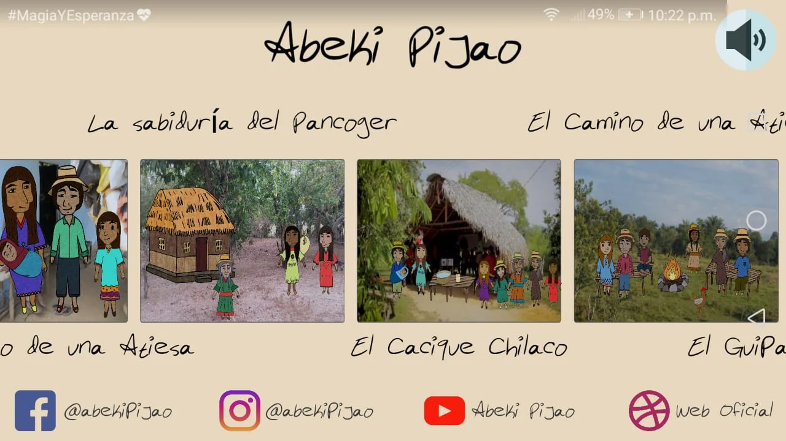
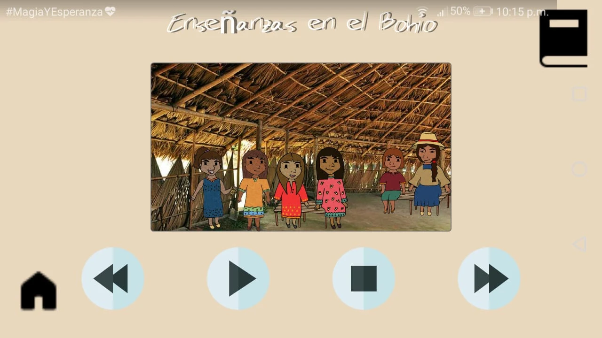
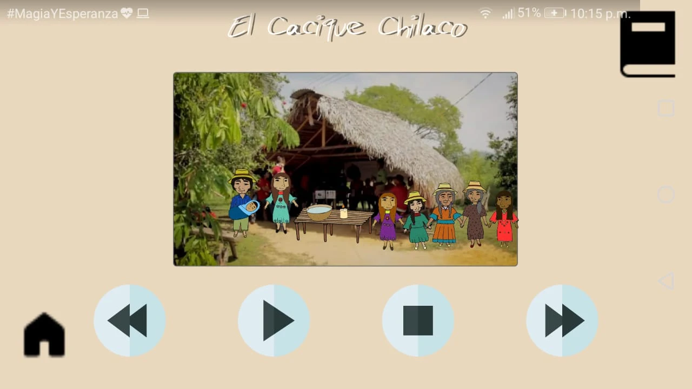
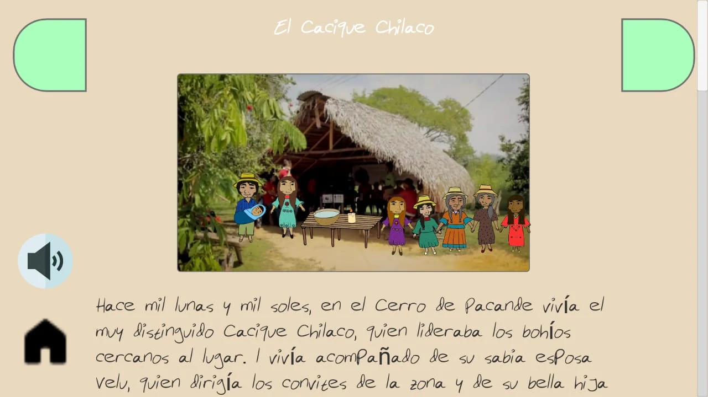
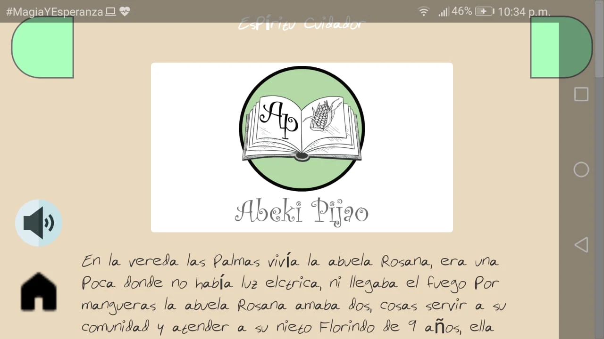
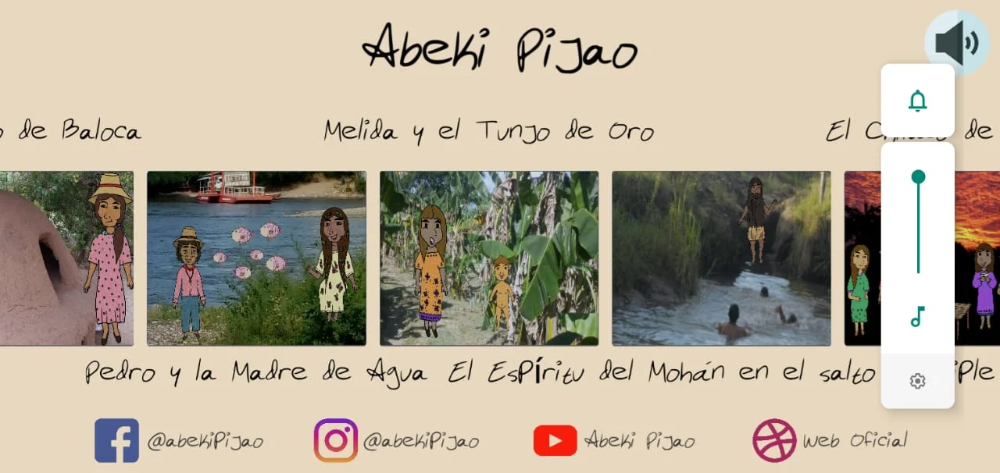

# Abeki Pijao

## Historias de los Indigenas Pijao
Te presentamos la primera app de cuentos infantiles creado por indígenas Pijao para niños, niñas jóvenes, adultos y personas mayores indígenas o de cualquier otra comunidad, interesados en conocer diversos aspectos de la cultura indígena Pijao.

En la App vas a encontrar cuentos infantiles que narran historias y vivencias de los Tatas (abuelos) quienes con sus relatos resguardan, fortalecen y mantienen vivas los conocimientos ancestrales de la comunidad y su territorio.

Por medio de los relatos el público en general podrá enterarse de las tradiciones Pijao que aun hoy se mantienen vivas dentro y fuera del territorio tolimense.
Los saberes ancestrales que encontraras dentro de los cuentos te ayudará a convivir en harmonía con el hombre y con la Madre Tierra

## Proceso de creacion

## Resultado

## Disponible en
### Play Store
https://play.google.com/store/apps/details?id=com.CabildoAmbikaPijao.AbekiPijao&hl=es
### App Store
En Proceso
